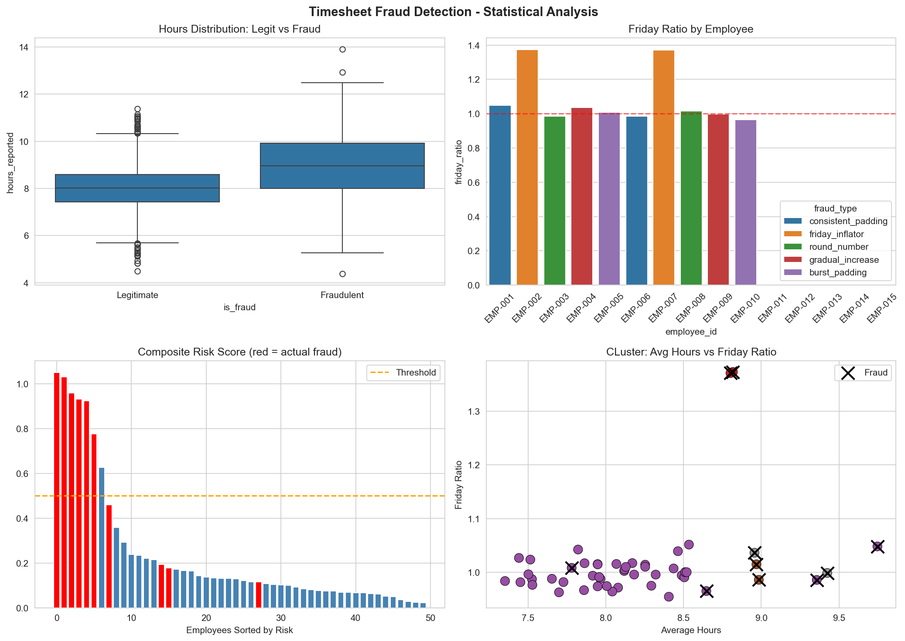

# 📊 Timesheet Fraud Detection Lab

A fraud detection system that generates synthetic timesheet data with injected fraud patterns, applies statistical and machine learning methods to identify them, and outputs the results to an interactive Excel dashboard.

Built with Python (pandas, scipy, scikit-learn, seaborn) and Excel (formulas, conditional formatting, charts).



---

## Table of Contents

- [Overview](#overview)
- [Fraud Patterns](#fraud-patterns)
- [Detection Methods](#detection-methods)
- [Project Structure](#project-structure)
- [How to Run](#how-to-run)
- [Results](#results)
- [Tech Stack](#tech-stack)

---

## Overview

This project simulates a realistic timesheet fraud scenario: 50 employees reporting daily hours over 6 months (January–June 2024), producing ~6,500 records. 10 employees (20%) have injected fraud patterns designed to mimic real-world timesheet manipulation techniques.

The pipeline has three stages:

1. **Data Generation** (`timeSheetFraudLab.py`) — Creates synthetic but statistically realistic timesheet data using truncated normal distributions per department, then injects 5 distinct fraud patterns.
2. **Statistical Analysis** (`timesheetAnalysis.py`) — Engineers behavioral features per employee and applies three detection methods (IQR, Isolation Forest, KMeans), combining them into a composite risk score.
3. **Excel Dashboard** (`build_dashboard.py`) — Exports results to an Excel workbook with live formulas (AVERAGEIF, AVERAGEIFS, MAXIFS, SUMPRODUCT), conditional formatting (traffic-light risk flags, color scales, data bars), and auto-filters.

---

## Fraud Patterns

Each fraud type is assigned to 2 employees (10 fraudulent out of 50):

| Fraud Type | Behavior | Statistical Signature |
|---|---|---|
| **Consistent Padding** | Adds 1–2 extra hours every day | Higher `avg_hours` vs department peers |
| **Friday Inflator** | Adds 2–4 hours only on Fridays | `friday_ratio` > 1.2 (Friday avg / non-Friday avg) |
| **Round Number** | Reports only 8, 9, or 10 hours | `round_pct` = 100%, very low `coeff_variation` |
| **Gradual Increase** | Hours increase +0.5h per month | Positive `monthly_slope` via linear regression |
| **Burst Padding** | 20% of days get +3–5 extra hours | High `pct_outlier_days`, heavy right tail |

---

## Detection Methods

### Feature Engineering (6 features per employee)

- `avg_hours` — Mean daily hours reported
- `friday_ratio` — Friday average / non-Friday average
- `coeff_variation` — Standard deviation / mean (normalized dispersion)
- `round_pct` — Proportion of days with integer hours
- `monthly_slope` — Linear regression slope across 6 months
- `pct_outlier_days` — Percentage of days with |z-score| > 2

### Detection Algorithms

| Method | Approach | Strengths | Result |
|---|---|---|---|
| **IQR** | Flags values outside Q1−1.5×IQR / Q3+1.5×IQR per feature; threshold ≥2 flags | Explainable, no training needed | 6 flagged, 5 true positives |
| **Isolation Forest** | Isolates anomalies via random cuts in feature space; fewer cuts = more anomalous | Detects multi-dimensional anomalies | 10 flagged, 7 true positives |
| **KMeans (K=4)** | Groups employees by behavioral similarity; fraud-dense clusters = higher risk | Discovers unknown patterns | Separated friday_inflators, round_numbers, gradual_increase into distinct clusters |

### Composite Risk Score

A weighted ensemble combining all three methods:

```
risk_score = 0.35 × iqr_score + 0.40 × iso_norm + 0.25 × cluster_risk
```

With threshold = 0.5: **7 flagged, 6 true positives, 1 false positive** (85.7% precision, 60% recall).


---

## Project Structure

```
timesheet-fraud-lab/
├── README.md
├── requirements.txt
├── timeSheetFraudLab.py       # Stage 1: Data generation + fraud injection
├── timesheetAnalysis.py       # Stage 2: Feature engineering + detection
├── build_dashboard.py         # Stage 3: Excel dashboard with live formulas
├── images/
│   ├── fraud_analysis_chart.png
│   └── fraud_heatmap.png
└── output/
    ├── timesheet_raw.csv      # 6,500 daily records
    └── timesheet_analysis.xlsx # Multi-sheet workbook
```

---

## How to Run

### Prerequisites

- Python 3.9+
- pip

### Installation

```bash
git clone https://github.com/Joaquin-mira/Data-Modeling-Analysis.git
cd Data-Modeling-Analysis/timesheet-fraud-lab
pip install -r requirements.txt
```

### Execution

Run in order:

```bash
# 1. Generate synthetic data
python timeSheetFraudLab.py

# 2. Run statistical analysis and generate visualizations
python timesheetAnalysis.py

# 3. Build Excel dashboard
python build_dashboard.py
```

Output files will be generated in the project root directory.

---

## Results

### Detection Summary

| Method | Flagged | True Positives | False Positives | Precision |
|---|---|---|---|---|
| IQR (≥2 flags) | 6 | 5 | 1 | 83.3% |
| Isolation Forest | 10 | 7 | 3 | 70.0% |
| Composite (≥0.5) | 7 | 6 | 1 | 85.7% |

### Excel Dashboard Features

- **Employee_Analysis sheet**: All metrics calculated with Excel formulas (AVERAGEIF, AVERAGEIFS, MAXIFS, SUMPRODUCT, STDEV array formulas) so the dashboard recalculates dynamically if data changes.
- **Conditional formatting**: Traffic-light risk flags (HIGH/MEDIUM/LOW), green-to-red color scales on avg hours, blue data bars on Friday ratio.
- **Auto-filters**: Click to filter by department, risk level, or any column.

### Key Insights

- **No single method catches all fraud types.** IQR misses subtle patterns; Isolation Forest has more false positives; KMeans groups but doesn't rank. The composite score balances all three.
- **Burst padding is the hardest to detect** because most days look normal — only 20% of days are inflated, which dilutes the signal in aggregate metrics.
- **Context matters.** Department-specific distributions prevent naive detection (Engineering averages 8.2h vs Sales 7.8h), so all comparisons must be within-context.

---

## Tech Stack

| Tool | Usage |
|---|---|
| **Python** | Data generation, analysis, automation |
| **pandas** | Data manipulation and aggregation |
| **scipy.stats** | Truncated normal distributions, linear regression |
| **scikit-learn** | Isolation Forest, KMeans, StandardScaler |
| **seaborn / matplotlib** | Statistical visualizations |
| **openpyxl** | Excel workbook creation with formulas and formatting |
