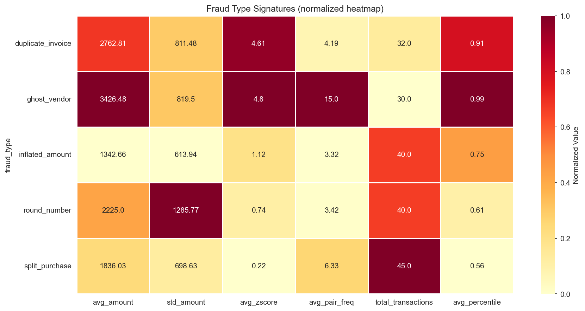

# 📊 Financial Forensic Audit Lab

A financial fraud detection system that generates realistic transaction data with 5 injected fraud patterns, then applies multi-layered detection using Excel (manual formulas + Power Query) and statistical analysis.

---

## Overview

A Python script seeds a dataset of ~15,000 transactions across 100 employees and 70 vendors, with realistic distributions per spending category (IT, Logistics, Marketing, Supplies, Travel). 10 employees are injected with 5 distinct fraud patterns — 2 employees per type.

The detection phase is performed entirely in Excel, simulating how a non-technical fraud analyst would investigate the data using formulas, Pivot Tables, and Power Query.

**Pipeline:**

1. **Data Generation** (`forensicAuditScript.py`) — Generates transactions with category-specific distributions using `scipy.stats.truncnorm`, injects 5 fraud types, calculates statistical features, and exports to CSV.
2. **Manual Analysis** (`fraud_analysis_manual.xlsx`) — Excel workbook with helper columns, Pivot Tables, and conditional formatting built during the investigation.
3. **Formula Reference** (`EXCEL_FORMULA_GUIDE.md`) — Step-by-step guide for reproducing the detection using Excel formulas.
4. **Automated Detection** (`forensic_audit_workflow.json`) — N8N workflow that runs all 5 detection queries against PostgreSQL in parallel, feeds results to an AI agent (Gemma via Ollama) that classifies findings and generates an executive summary, and persists the report to the database.

---

## Fraud Patterns

| Fraud Type | Description | Signal | Detection Method |
|---|---|---|---|
| **Split Purchase** | Fragments large purchases to stay below $5,000 approval threshold | Same employee + vendor + date, group total > $5,000, each fragment < $5,000 | Group By + threshold comparison |
| **Duplicate Invoice** | Submits the same invoice twice with minor amount variation (±3%) | Same `invoice_number` appearing more than once | COUNTIF on invoice_number |
| **Ghost Vendor** | Bills through a fake vendor that only invoices to one employee | Vendor with only 1 unique employee across all transactions | Pivot Table with Distinct Count |
| **Inflated Amount** | Systematically inflates amounts 40–80% above category average | Consistently high z-score within category | Z-score analysis (subtle — hard to detect with averages) |
| **Round Number** | Always submits exact round amounts ($500, $1,000, $2,500...) | MOD(amount, 500) = 0 with zero cents | MOD function + employee-level pattern |

---

## Detection Results

Analysis performed in Excel with formulas and Power Query:

| Detection | Flagged | True Positives | False Positives | Precision | Fraudsters Found |
|---|---|---|---|---|---|
| Split Purchase | 47 | 45 | 2 | 95.7% | EMP-001, EMP-006 |
| Duplicate Invoice | 32 | 32 | 0 | 100% | EMP-002, EMP-007 |
| Ghost Vendor | 2 vendors | 2 | 0 | 100% | EMP-003, EMP-008 |
| Round Number | 40 | 40 | 0 | 100% | EMP-010, EMP-005 |
| Inflated Amount | — | — | — | — | Not detected cleanly* |

*Inflated amount detection produces weak signal with averages because only 13% of the fraudster's transactions are inflated, diluting the employee-level statistics. This is a realistic finding — it's the type of fraud that requires distributional analysis (SQL window functions or Python ML) rather than threshold-based rules.

**Composite Risk Scoring** ranked all 8 detected fraudsters in the top 8 positions out of 100 employees.

---

## Visualizations

### Data Overview


### Fraud Type Signatures


---

## N8N Automated Detection Workflow

The workflow (`forensic_audit_workflow.json`) can be imported into any N8N instance. It automates the full detection + AI analysis pipeline:

**Manual Trigger** → **5 PostgreSQL detection queries** (split purchase, duplicate invoice, ghost vendor, inflated amount, round number) run in parallel → **Merge** waits for all 5 → **JavaScript** formats a unified audit report → **AI Agent** (Gemma via Ollama) classifies each finding as Confirmed Fraud / Probable Fraud / Needs Investigation / False Positive, cross-references employees across detection layers, and generates an executive summary → **Parse** extracts structured data → **Save to PostgreSQL** + **Alert** if severity is CRITICAL.

### Sample AI Output

The AI agent identified EMP-002 and EMP-007 as highest priority (multiple detection layers), classified the overall severity as CRITICAL, and recommended immediate investigation with specific next steps per case type.

---

## Project Structure

```
forensic-audit-lab/
├── README.md
├── requirements.txt
├── EXCEL_FORMULA_GUIDE.md              # Step-by-step Excel detection guide
├── forensicAuditScript.py              # Data generation + fraud injection
├── forensic_audit_workflow.json        # N8N workflow (importable)
├── fraud_analysis_manual.xlsx          # Excel workbook with analysis
├── images/
│   ├── forensic_audit_overview.png
│   └── forensic_fraud_signatures.png
└── output/
    ├── transactions.csv                # 15,187 transactions
    ├── employees.csv                   # 100 employee profiles
    ├── vendors.csv                     # 72 vendors (70 regular + 2 ghost)
    └── ground_truth.csv                # Fraud breakdown for validation
```

---

## How to Run

### Prerequisites

- Python 3.9+
- pip

### Generate the dataset

```bash
cd Data-Modeling-Analysis/forensic-audit-lab
pip install -r requirements.txt
python forensicAuditScript.py
```

This creates the `output/` folder with all CSV files and the `images/` folder with visualizations.

### Analyze in Excel

1. Open Excel → Data → Get Data → From Text/CSV → select `output/transactions.csv`
2. Follow `EXCEL_FORMULA_GUIDE.md` for step-by-step detection, or open `fraud_analysis_manual.xlsx` to see the completed analysis

---

## Key Takeaways

- **4 out of 5 fraud types are detectable with Excel formulas alone.** Split purchase, duplicate invoice, ghost vendor, and round number fraud all have clear deterministic signals.
- **Inflated amount fraud requires statistical depth.** When only 13% of transactions are inflated, employee-level averages don't separate fraudsters from noise. SQL `PERCENT_RANK() OVER (PARTITION BY category)` or Python Isolation Forest would improve detection.
- **Composite scoring is the real deliverable.** Individual detections flag transactions; the risk score ranks employees for investigation priority. The top 8 of 100 employees contained all 8 detectable fraudsters.
- **False positives are expected and manageable.** Split purchase detection had 2 FPs out of 47 flags (95.7% precision). In practice, these are resolved with a quick manual review.

---

## Tech Stack

| Tool | Usage |
|---|---|
| **Python** | Synthetic data generation, statistical feature engineering |
| **scipy (truncnorm)** | Category-specific realistic amount distributions |
| **pandas** | Data manipulation, aggregation, export |
| **seaborn / matplotlib** | Visualization (overview charts, heatmap) |
| **Excel (Formulas)** | COUNTIF, SUMIF, AVERAGEIF, MOD, z-score calculation |
| **Excel (Pivot Tables)** | Ghost vendor detection with Distinct Count |
| **Excel (Power Query)** | Reproducible Group By transformations |
| **PostgreSQL** | Transaction storage, detection queries |
| **N8N** | Workflow orchestration (parallel detection + AI pipeline) |
| **Gemma (Ollama)** | AI-driven fraud classification and executive summary |
